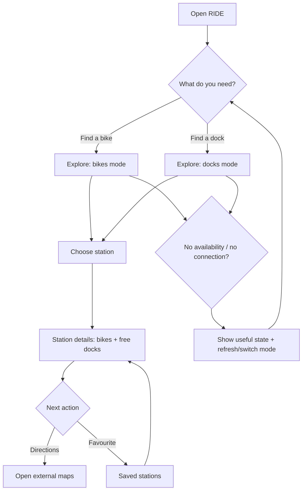

# RIDE — Userflow

```mermaid
flowchart TD
 A[Open RIDE] --> B{What do you need?}
 B -->|Find a bike| C[Explore: bikes mode]
 B -->|Find a dock| D[Explore: docks mode]
 C --> E[Choose station]
 D --> E
 E --> F[Station details: bikes + free docks]
 F --> G{Next action}
 G -->|Directions| H[Open external maps]
 G -->|Favourite| I[Saved stations]
 I --> F
 C --> J{No availability / no connection?}
 D --> J
 J --> K[Show useful state + refresh/switch mode]
 K --> B
```

Both map and list should offer access to every station's individual detail page. Data can update, so always show last updated timestamp.
